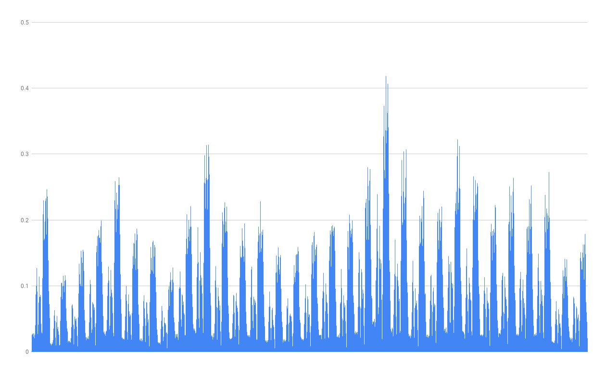

# Time Series Generator

Generates time series:
- between two dates expressed as `yyyy-MM-dd` in local time, 
- giving a total of `X`,
- limiting values throughout the day according to [Limited Randoms Generator](https://github.com/bkaminnski/limited-randoms).

## Usage

```
mvn clean install
java -jar .\target\timeseriesgenerator-0.0.1-SNAPSHOT-jar-with-dependencies.jar 2019-07-01 2019-08-01 255 1;1;1;1;1;3;9;2;1;4;3;3;1;1;1;8;6;9;7;8;9;5;3;1
```

